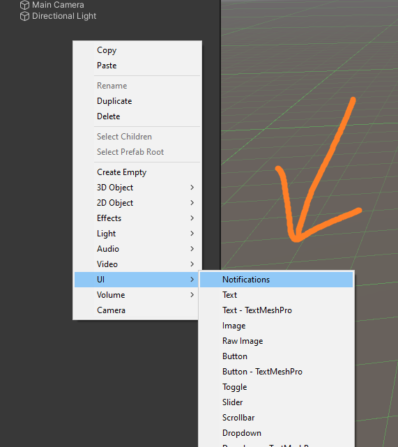
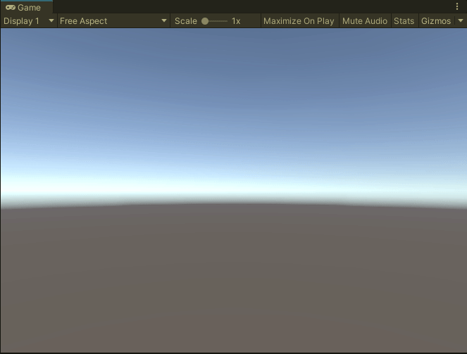
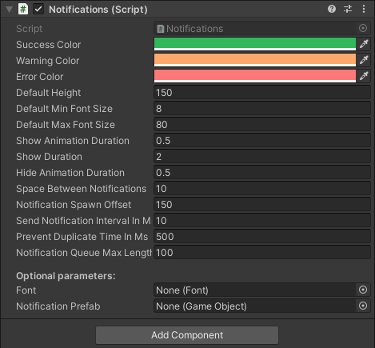

[](https://openupm.com/packages/com.3d-group.unity-simple-notifications/)
[](https://opensource.org/licenses/MIT)

# Unity simple notifications

Simple but powerful UI notifications package for Unity game engine.

- [How to use](#how-to-use)
- [Install](#install)
  - [via OpenUPM](#via-openupm)
  - [via Git URL](#via-git-url)
- [Performance and thread safety](#performance-and-thread-safety-rocket)
- [Configuration](#configuration)

<!-- toc -->

## How to use

1. Right click scene hierarchy
2. Click UI/Notifications



Now you can send Notifications from your script like this:
```c#
Notifications.Send("Hello world");
```



## Install

### via OpenUPM

The package is available on the [openupm registry](https://openupm.com). It's recommended to install it via [openupm-cli](https://github.com/openupm/openupm-cli).

```
openupm add com.3d-group.unity-simple-notifications
```

### via Git URL

Open `Packages/manifest.json` with your favorite text editor. Add following line to the dependencies block:
```json
    {
        "dependencies": {
            "com.littlebigfun.addressable-importer": "https://github.com/3d-group/unity-simple-notifications.git"
        }
    }
```

## Performance and thread safety :rocket:

- Notifications are rate limited based on duplicates sent recently and max notifications queue length 
- Notifications can be send from another thread. Creating GameObjects still always happens on main thread

Here is how it looks when billion notifications are sent simultaneously from another thread: :smile:


Try it yourself! Code:
```c#
using UnityEngine;
using System.Threading;
using Group3d.Notifications;

public class TEST : MonoBehaviour
{
    private void Start()
    {
        new Thread(() =>
        {
            Thread.CurrentThread.IsBackground = true;
            var r = new System.Random();
            int counter = 0;
            while (counter < 1000000000)
            {
                Notifications.Send($"Test {r.Next(0, 10000)}");
                counter++;
            }
        }).Start();
    }
}

```

## Configuration

Confurable from the inspector:


